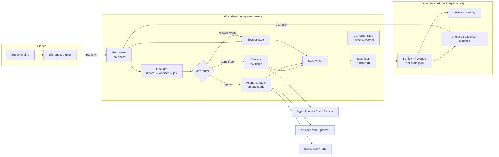

# feat: Dim autonomous voice assistant for Omarchy

## Summary

Evolve `dim-agent` from a spawn-per-trigger app launcher into a resident voice assistant: `dimd` becomes a systemd user daemon holding session/task/agent state behind a unix-socket IPC; Jev routes utterances to a risk-tiered toolbelt, `ori opencode` agent spawns, or conversational answers; the UI becomes an Omarchy shell plugin (`io.github.duketopceo.dim`) providing a center bar icon, listening overlay, choice/transcript widgets, and agent progress; a weekly corrections loop stages Jev criteria improvements for review. Generic and public-ready — dayflow, Rowboat, and personal config are optional plugins, never dependencies.

## Problem Frame

Real-world testing showed the current slice fails as an assistant: `pw-record` quirks aside, correct Jev decisions were cancelled by an over-strict action-confidence gate ("let's play retroarch" → retroarch 0.90, cancelled on action 0.49), conversational utterances were forced into actions ("what can I say?" → terminal/type_text), and the app vocabulary was hardcoded. Beyond tuning, the product direction is a Hey Clicky-style resident assistant — which requires persistent state, a widget surface, a toolbelt, and spawnable agents that the current one-shot architecture cannot express.

## Requirements Trace

| Origin req | Plan coverage |
|---|---|
| R1 resident daemon | U1 (daemon + IPC + systemd), all units build on it |
| R2 Jev decision brain | U2 (routing schema, confidence redesign, context), U3 (tools it routes to) |
| R3 toolbelt | U3 |
| R4 ori opencode agents | U6 (spawn/registry/status/cancel), U4/U5 (surfaces) |
| R5 widget framework + bar icon | U4 (plugin scaffold, overlay, bar icon), U5 (widgets) |
| R6 text-first + optional espeak | U5 |
| R7 week-by-week learning | U7 |
| R8 generic shippable app | U8 (genericity pass, install, docs) |

---

## Key Technical Decisions

| Decision | Choice | Rationale |
|---|---|---|
| Widget toolkit | **Omarchy shell plugin (quickshell)** | Omarchy 4.0's shell has a plugin system with `service`/`bar-widget`/`overlay`/`panel` kinds and `omarchy-shell <target> <method>` IPC; user already runs third-party plugins (`io.github.duketopceo.dayflow` etc.). Replaces GTK `dim-overlay` rather than maintaining two UI stacks. (see origin: R5, open question resolved) |
| Daemon IPC | **Unix socket at `$XDG_RUNTIME_DIR/dim-agent/dimd.sock`, newline-delimited JSON** | Simple, inspectable (`socat`/tests can drive it), no deps. The shell plugin calls `omarchy-shell`-style polling of daemon state files rather than holding the socket. |
| Daemon↔shell-plugin bridge | **Daemon writes `$XDG_RUNTIME_DIR/dim-agent/state.json`; plugin polls it + `omarchy-shell` target for push** | Quickshell plugins can't hold arbitrary sockets cleanly; a small state file + poll keeps the plugin dumb. |
| Code-agent path | **`ori opencode` headless (`--prompt`), spawned as detached process with captured stdout** | All OpenRouter, one auth path; headless output is parseable into task status. Interactive TUI deferred. |
| Agent registry | **Named tasks in `~/.local/share/dim-agent/tasks.jsonl` + per-task log files** | Append-only, survives daemon restart, voice-queryable ("what's my agent doing"). |
| Confidence model | **Gate on target/app confidence; `launch` whitelisted action** | Fixes the "retro-large" cancellation: action confidence no longer kills high-confidence launches. Clarify-widget replaces silent low-confidence execution. |
| Corrections | **Human-gated weekly staging** | Weekly pass proposes Jev criteria edits into a review file; user approves via widget/CLI. Auto-applying risks compounding a bad week. |
| Package layout | **`dim/` Python package; `dimd` stays the entry script** | Daemon needs modules (ipc, tools, agents, jev); flat single-file won't scale. Tests import the package, not the extensionless script. |
| Whisper model | **Bump default to `ggml-small.en.bin`** | Fixes transcript quality ("retroarch"→"retro-large"); ~2-3x cost is fine on M1. Config-overridable. |

---

## High-Level Technical Design



**Decision flow per trigger:** `Super+D` → trigger sends `listen` over the socket → daemon records+transcribes → Jev classifies (`launch` / `tool:<name>` / `agent` / `answer` / `clarify`) with context (active window, harness catalog, optional screenshot) → mutating/risky routes require a choice-widget confirmation → result written to `state.json` → plugin renders listening/transcript/result/progress → optional espeak.

---

## Output Structure

```
dim/
  __init__.py
  config.py          # TOML config + defaults (moved from dimd)
  ipc.py             # unix-socket server + client helpers
  state.py           # session/task/agent state, state.json writer
  jev.py             # decisions API client, schema, confidence policy
  tools/
    __init__.py      # tool registry + risk tiers + confirmation policy
    desktop.py       # launch/focus/close, hyprctl window/workspace ops
    system.py        # notify, screenshot (grim), type (wtype), shell (guarded)
    agents.py        # ori opencode spawn/monitor/stop + task registry
    adapters.py      # optional plugins: dayflow, omaseal, harness catalog
  pipeline.py        # record → transcribe → route → act
  learn.py           # corrections auto-record + weekly staging
dimd                 # thin entry: daemon main + CLI subcommands
shell-plugin/        # ships as io.github.duketopceo.dim
  manifest.json
  BarWidget.qml      # center bar icon
  DimService.qml     # polls state.json, exposes IPC target
  ListeningOverlay.qml
  ChoiceWidget.qml
  AgentPanel.qml
systemd/dimd.service # user unit
```

`dim-overlay` (GTK) is removed once the plugin lands; `scripts/build_harness.py` and `scripts/propose_criteria.py` stay as-is (harness feeds adapters, learner supersedes propose script over time).

---

## Implementation Units

### U1. Resident daemon + IPC

**Goal:** `dimd` runs as a persistent systemd user service; the existing trigger becomes an IPC client, not a process spawner.

**Requirements:** R1, R5 (daemon state is what widgets render)

**Files:** `dim/ipc.py`, `dim/state.py`, `dimd` (rewritten to daemon main + `trigger`/`status`/`stop` subcommands), `systemd/dimd.service`, `tests/test_ipc.py`, `tests/test_state.py`

**Approach:** Socket at `$XDG_RUNTIME_DIR/dim-agent/dimd.sock`, newline-JSON messages (`{"cmd":"listen"}`, `{"cmd":"choice","id":..,"pick":..}`, `{"cmd":"status"}`). Daemon owns the listen pipeline; `state.py` serializes session/task/agent state to `state.json` on every transition. Trigger shim sends `listen` and exits. Systemd unit: `Restart=on-failure`, `After=graphical-session.target`.

**Patterns to follow:** existing `dimd` config/env loading; XDG path conventions already in the repo.

**Test scenarios:**
- Happy: `status` command on a running daemon returns JSON state with daemon pid and idle session
- Happy: two sequential `listen` commands share session state (second sees the first's transcript history)
- Edge: socket file exists but daemon dead → `status` reports unreachable, does not hang
- Edge: malformed JSON line on socket → error response, connection closed, daemon survives
- Integration: state transitions (idle→listening→deciding→done) each rewrite `state.json` atomically

**Verification:** `systemctl --user start dimd` runs persistently; `dimd trigger` and `dimd status` work against the socket; daemon survives trigger client exit.

### U2. Jev routing v2 + confidence redesign + context

**Goal:** Jev classifies into `launch` / `tool` / `agent` / `answer` / `clarify`; confidence gating stops killing correct launches; conversational utterances get answered; decisions get active-window + optional screenshot context.

**Requirements:** R2; success criteria "retro-large" case and "what can I say?" case

**Dependencies:** U1

**Files:** `dim/jev.py`, `dim/pipeline.py`, `dim/config.py` (model pin `typesafe/jev-1.13`, whisper `small.en` default, espeak flag), `tests/test_jev.py`, `tests/test_pipeline.py`

**Approach:** Extend the decisions request schema: questions gain `route` (launch/tool/agent/answer/clarify) and per-route criteria; app criteria still come from the harness catalog when present. Execution policy: `launch` executes when app confidence ≥ threshold regardless of action confidence; other routes gate on their own confidence; below threshold → `clarify` state with choices (not silent execute, not dead cancel). Context: `hyprctl activewindow -j` + workspace always; `grim` screenshot only when Jev requests `needs_screen` or route is `agent`/`tool:screen`. Whisper default `ggml-small.en.bin` with config override.

**Test scenarios:**
- Happy: transcript "open discord" with app 0.93/action 0.49 → executes launch (regression test for the retro-large bug)
- Happy: "what can I say?" → route `answer`, text response produced, no action attempted
- Edge: app confidence 0.4 → `clarify` state listing top candidates, nothing executed
- Edge: `[BLANK_AUDIO]` → early exit, no Jev call (existing behavior preserved)
- Error: OpenRouter unreachable → state `error`, no partial action
- Integration: decision `state` payload includes active window title/class and harness summary

**Verification:** canned Jev responses drive each route end-to-end in tests; the two logged failure transcripts route correctly.

### U3. Toolbelt registry

**Goal:** Structured tool registry — each tool declares name, schema, risk tier, confirm policy — replacing the hardcoded launch path.

**Requirements:** R3

**Dependencies:** U1 (execution lives in daemon), U2 (Jev routes to tools)

**Files:** `dim/tools/__init__.py`, `dim/tools/desktop.py`, `dim/tools/system.py`, `tests/test_tools.py`

**Approach:** Registry maps tool name → callable + metadata (`risk: safe|mutating|shell`). `safe` executes inline; `mutating` (window ops, typing, close) requires choice-widget confirm unless user enabled elevated mode in config; `shell` requires explicit per-call confirm. Initial tools: launch/focus/close app, workspace switch, notify, screenshot-to-file, `wtype` text, guarded shell (denylist + confirm), agent lifecycle (delegates to U6's manager), optional adapters (dayflow query, omaseal resolve — loaded only if present).

**Test scenarios:**
- Happy: registry resolves `launch` → executes with verified binary (existing check preserved)
- Happy: `mutating` tool emits a confirm request instead of executing; approved confirm executes it
- Edge: unknown tool name in Jev response → `clarify`/`error`, never executed
- Edge: `shell` tool receives denylisted command (e.g., `rm -rf /`) → refused before confirm
- Integration: Jev `tool:switch_workspace 3` routes through registry to `hyprctl workspace 3`

**Verification:** every registered tool is reachable via a canned Jev decision in tests; risk tiers enforce confirm behavior.

### U4. Omarchy shell plugin scaffold

**Goal:** `io.github.duketopceo.dim` plugin ships in `shell-plugin/`: manifest, center bar icon, service that renders daemon state, listening overlay replacing GTK `dim-overlay`.

**Requirements:** R5 (icon, listening/status widgets), R1 (visualizes daemon state)

**Dependencies:** U1 (state.json contract)

**Files:** `shell-plugin/manifest.json`, `shell-plugin/BarWidget.qml`, `shell-plugin/DimService.qml`, `shell-plugin/ListeningOverlay.qml`, `shell-plugin/StateStore.qml`, `tests/test_plugin_manifest.py`, `dim-overlay` (deleted), `dimd` install path updated

**Approach:** Follow the installed-plugin convention (`~/.config/omarchy/plugins/<id>/` with `manifest.json` declaring `kinds:["service","bar-widget","overlay"]`). `DimService`/`StateStore` polls `state.json` (~250ms while active, idle otherwise) and exposes plugin state to bar icon + overlay. Bar icon shows Dim state (idle/listening/thinking/agent-running) at bar center via plugin config. `ListeningOverlay` reproduces the breathing-dim effect driven by a `level` field the daemon publishes. `dimd install` copies the plugin into `~/.config/omarchy/plugins/` and removes the GTK overlay.

**Patterns to follow:** `io.github.duketopceo.dayflow` plugin layout (manifest + BarWidget + service structure); `/usr/share/omarchy/shell/Ui/BarWidget.qml` primitives.

**Test scenarios:**
- Happy: manifest validates against installed-plugin schema (kinds, id, version fields present)
- Happy: state file showing `listening` + amplitude → service state reflects it (QML logic kept thin/testable via extracted JS if possible; otherwise manual verify)
- Edge: missing/stale `state.json` → plugin shows idle/offline icon, no crash
- Integration: install places plugin in plugin dir; `omarchy-shell shell listPlugins` shows `io.github.duketopceo.dim`

**Verification:** plugin appears in `listPlugins`, icon renders center-bar, `Super+D` drives the overlay through listen→result without GTK overlay.

### U5. Response, choice, and voice-out widgets

**Goal:** Transcript/answer text widget, confirmation choice widget (writes picks back over IPC), optional espeak spoken replies.

**Requirements:** R5, R6; clarify flow from U2

**Dependencies:** U4 (widget host), U1 (choice IPC)

**Files:** `shell-plugin/ChoiceWidget.qml`, `shell-plugin/TranscriptWidget.qml`, `shell-plugin/AgentPanel.qml` (scaffold — populated in U6), `dim/state.py` (pending-choice state), `dim/ipc.py` (`choice` command), `tests/test_choice_flow.py`

**Approach:** Clarify/confirm states carry `choices[]`; `ChoiceWidget` renders them and sends `{"cmd":"choice","pick":n}` — daemon resumes the pending action or cancels. Transcript widget shows heard text + Jev's answer for `answer` route (auto-fades). `espeak`/`espeak-ng` fired on answers when `voice = true` in config; absent binary → silent no-op.

**Test scenarios:**
- Happy: clarify state with 3 choices → `choice` IPC with `pick:1` resumes pending action with corrected target
- Happy: answer route renders response text and (with voice enabled + espeak mocked) fires speak call
- Edge: choice arrives after state moved on (timeout) → ignored gracefully
- Edge: espeak binary missing → answer still renders, no error
- Integration: full loop — ambiguous utterance → widget choices → pick → launch corrected app (the existing buttons path, now daemon-mediated)

**Verification:** ambiguous voice input resolves through the widget end-to-end on the live desktop.

### U6. Agent spawning via ori opencode

**Goal:** `"Dim, agent — <task>"` spawns a named, persistent `ori opencode` headless task; status/progress visible in `AgentPanel`; voice query and cancel supported.

**Requirements:** R4

**Dependencies:** U1, U2 (`agent` route), U3 (agent tools), U4 (panel)

**Files:** `dim/tools/agents.py`, `dim/agents.py` (manager), `shell-plugin/AgentPanel.qml`, `tests/test_agents.py`

**Approach:** Agent manager spawns `ori opencode --prompt "<task>"` (exact CLI flags verified at implementation time against `ori opencode --help`) as a detached child with cwd = current project or `~/`; writes `tasks.jsonl` record (id, name, prompt, pid, started, status) and tees output to `~/.local/share/dim-agent/tasks/<id>.log`. Status derived from liveness + log tail (last non-empty line → `state.json` task summary). `{"cmd":"task_status","name":..}` and `{"cmd":"task_cancel","name":..}` on IPC. Panel lists active/recent tasks with status lines.

**Test scenarios:**
- Happy: `agent` route with task text → registry record created, process spawned (mocked `subprocess`), status readable
- Happy: `task_status` on running task returns name + latest log line
- Edge: `ori` binary missing → route returns error state, no registry entry
- Edge: duplicate task name → suffixed id, both tracked
- Error: child exits nonzero → task marked failed with log tail preserved
- Integration: spawned task survives daemon restart (registry reload reconciles dead pids)

**Verification:** live spawn of a trivial opencode prompt shows progress in the panel and is cancellable.

### U7. Weekly learning loop

**Goal:** Choice-widget picks auto-record to `corrections.jsonl`; a weekly pass aggregates corrections + decision log into staged Jev criteria proposals for user review.

**Requirements:** R7

**Dependencies:** U5 (picks recorded via IPC), U2 (criteria it proposes against)

**Files:** `dim/learn.py`, `scripts/propose_criteria.py` (folded in or superseded), `systemd/dimd-learn.timer`, `tests/test_learn.py`

**Approach:** Every `choice` IPC appends `{heard, chose, rejected, ts}` to `corrections.jsonl`. Weekly (systemd timer or `dimd learn`): aggregate week's corrections + low-confidence decisions → produce `~/.local/share/dim-agent/proposals/YYYY-WW.md` with suggested criteria edits + before/after accuracy replay on logged decisions. User reviews (`dimd learn --review`) and approves; approved edits merge into local criteria overrides (not repo files).

**Test scenarios:**
- Happy: 3 corrections logged → proposal file lists each with suggested criteria text
- Happy: replay shows corrected decision on the logged transcript (e.g., retro-large → retroarch now scores launch)
- Edge: empty week → no proposal, exit clean
- Edge: approved proposal merges into overrides without touching repo files
- Integration: corrections written by U5's choice flow are consumed by the learner unmodified

**Verification:** a week of logged corrections produces a reviewable proposal; approving it changes subsequent canned decisions.

### U8. Genericity pass, install, docs

**Goal:** Fresh-install path works without dayflow/Rowboat/personal config; install wires plugin + service + bind; README rewritten for the assistant.

**Requirements:** R8

**Dependencies:** U1–U7

**Files:** `dimd` (install subcommand), `dim/tools/adapters.py`, `scripts/build_harness.py` (generic fallback: scan `$PATH`/`~/.local/bin` + desktop files when no dayflow db), `README.md`, `tests/test_dimd.py` (updated for package layout), `.github/workflows/test.yml` (unchanged runner, updated test imports)

**Approach:** Adapter interface: `context()` → optional enrichment dict; `apps()` → catalog. `dayflow` adapter loads only if `~/.local/share/dayflow/dayflow.db` exists; generic adapter mines `.desktop` files + PATH binaries. Install: copies package + plugin, writes systemd unit, adds `SUPER+D` Lua bind (existing mechanism), runs `systemctl --user daemon-reload`. README: architecture diagram, install, hotkey, plugin enable, config reference, dayflow/omaseal as optional.

**Test scenarios:**
- Happy: generic adapter produces non-empty app catalog on a host with no dayflow db
- Happy: `dimd install` on a clean prefix creates unit, plugin dir, bind, config — idempotent on re-run
- Edge: dayflow db present → dayflow adapter preferred; absent → generic, no error
- Regression: all existing 12 tests still pass under the package layout (import path updates only)

**Verification:** on this machine after install: service runs, plugin listed, `Super+D` full loop works; simulated no-dayflow env still produces a working catalog.

---

## Scope Boundaries

**Deferred to Follow-Up Work**
- Interactive `ori opencode` TUI spawn mode (watchable terminal agent)
- Rowboat Personal bridge/surface
- Whisper live-streaming transcription (push-to-talk window stays fixed-length initially)
- Auto-applied criteria learning (weekly pass stays human-gated this round)

**True non-goals (from origin)**
- Wake-word / always-on listening
- Pixel-level GUI clicking (no accessibility-free pixel control)
- Rich TTS beyond optional espeak
- Continuous screen streaming

---

## Risks & Dependencies

| Risk | Mitigation |
|---|---|
| Quickshell plugin API details differ from assumptions (IPC direction, polling vs push) | U4 spike first within the unit; `DimService` keeps daemon contract in `state.json` so plugin stays replaceable |
| `ori opencode` headless output not parseable for progress | Verify flags at U6 start; degrade to pid-liveness + log tail (status without rich progress) rather than blocking the unit |
| Resident daemon leak/hang across days | `Restart=on-failure`, bounded session history, state.json atomic writes |
| Wayland typing (`wtype`) unreliable in some clients | Keep `wtype` behind `mutating` confirm; not load-bearing for core flows |
| Plugin requires omarchy shell running | Daemon is fully functional headless; plugin absence degrades to notify-send/text fallback |

Dependencies: `ori` CLI (installed), quickshell + omarchy shell (installed), whisper.cpp `small.en` model (download step in install docs), espeak (optional), grim/wtype (installed).

## Open Questions

- Exact `ori opencode` non-interactive flag surface (resolve at U6 start; `--prompt` assumed from `ori code` parity — verify `--help`)
- Whether omarchy shell plugins can receive pushed IPC calls (`omarchy-shell <target> <method>`) or must poll — U4 spike settles it; design tolerates either
- Whether the weekly learner should also re-mine the app catalog or stay criteria-only (default: criteria-only)

## Sources & Research

- Origin: `docs/brainstorms/2026-09-18-dim-autonomous-assistant-requirements.md`
- Omarchy shell plugin system: `omarchy-shell shell listPlugins`, installed examples under `~/.config/omarchy/plugins/` (dayflow, omaseal, numbat), primitives in `/usr/share/omarchy/shell/Ui/`
- `ori` CLI: `ori code`/`ori opencode`/`ori eval` subcommands confirmed installed (`~/.local/bin/ori`)
- Hey Clicky product research (cursor-side buddy, screen awareness, voice spawn "Clicky agent") — informed daemon + spawn + widget requirements
- Logged failure cases driving confidence redesign: `~/.local/share/dim-agent/decisions.jsonl` ("retro-large", "what can I say?")
