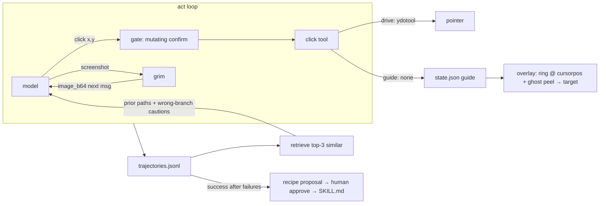

# feat: Guide cursor, pointer actuation, and episodic trajectory learning

## Summary

Make Wisp's computer-use legible and self-improving. Three coupled
changes: (1) a crisp **guide cursor** — a high-contrast ring locked
around the real cursor while Wisp works, with a distinct "ghost" cursor
that peels off the ring, animates to the target point, and shows exactly
where Wisp is about to act (replaces the Clicky-style tail-following the
user finds annoying); (2) a real **pointer tool** so the act loop can
click, not just type; (3) **episodic trajectory learning** — every act
run is recorded, retrieved on similar tasks, and distilled into
human-approved recipe skills, so a workflow that took 3 wrong branches
once converges to ~zero on the next attempt.

## Problem Frame

Today the act loop can reason about the screen (`[POINT]` markers,
screenshots) but has no pointer: `type_text` exists, `click` does not —
and `ydotool`/`wlrctl` aren't even installed on this machine. The model
also can't *see* its own screenshots (the `screenshot` tool returns a
file path as text), so "computer use" is effectively blind navigation.
When it goes wrong, nothing is retained: the next run of the same task
starts from zero. There is also no visual language for "Wisp is
pointing/clicking there" — the orb shows step text, not spatial intent.

Reference task (user's own acceptance case): *"VS Code — install the
Kubernetes extension":* open app → orient → find Extensions → search
"k8s"/"kubernetes" → pick the verified publisher entry → install →
confirm installed. First run may take wrong branches; the next run must
know better.

## Requirements

- **R1** While Wisp is acting, a high-contrast ring tracks the user's
  real cursor (polled `hyprctl cursorpos`, logical coords) — subtle,
  non-animated while idle; it does not chase or lag behind.
- **R2** When the act loop targets a point, a ghost cursor peels off the
  ring and animates to the target on the existing click-through overlay;
  in **guide mode** it parks there and waits for the user to click; in
  **drive mode** it lands and the `click` tool fires.
- **R3** New `click` pointer tool (mutating tier — confirm-gated).
  Backend autodetect: `ydotool` (via `ydotoold`) → `wlrctl` → none.
  When no injector exists the system degrades to guide mode (ghost shows
  where, user clicks) instead of failing the task.
- **R4** The act loop is vision-fed: after a `screenshot` step the image
  is attached to the next model message (reuse the existing
  OpenAI-content-list / ollama `images` machinery in `brain.chat`).
- **R5** Every act run appends a trajectory record to
  `trajectories.jsonl`: task, app, ordered steps, outcome, and any
  correction signal (label ✓/✗ already exists at turn level).
- **R6** At act start, similar past trajectories are retrieved
  (token-overlap scoring, cap 3) and injected as episodic context —
  prior successful paths as hints, prior wrong branches as explicit
  "don't do X" cautions.
- **R7** Successful-after-failure trajectories can be distilled into
  recipe skills (`recipe-<app>-<slug>`), proposed through the existing
  human-gated proposals flow (learn.py pattern) — never auto-applied.
- **R8** `wispd doctor` reports pointer-backend status; `[pointer]`
  config section controls backend + `mode = guide|drive|auto`.
- **R9** Default shipped posture is `guide` — Wisp points, the user
  clicks — until the user opts into drive. No pointer injection without
  a detected backend.

## Key Technical Decisions

- **KTD1 — Episodic memory, not weights.** "Extreme RL" is implemented
  as trajectory retrieval + distilled recipe rules in-context (a
  Reflexion-style loop), not fine-tuning. Wrong branches become explicit
  textual cautions; that's what makes "3 mistakes → ~0 next time"
  achievable with a fixed model.
- **KTD2 — Guide visuals live in the existing overlay window.** The
  click-through fullscreen layer already renders `[POINT]` markers
  (`shell-plugin/Companion.qml`). The ring + ghost are new elements in
  that window driven by a new `guide` field in `state.json` — no new
  layer surface, no new plugin process.
- **KTD3 — One pointer tool, two arg forms.** `click` accepts
  `"x,y"` (screenshot-pixel coords, mapped through `points.to_logical`)
  or `"x,y@logical"`. Single tool keeps the Jev/tool schema small.
- **KTD4 — Clicks stay mutating-tier.** Confirmation reuse means drive
  mode asks per click unless the user later relaxes it; the plan does
  not add a silent-click path.
- **KTD5 — Guide mode is a first-class outcome.** With no injector or
  `mode=guide`, `click` returns `GUIDE(x,y)` — the ghost parks at the
  target and the step counts as a user-handoff, not an error (no
  MAX_ERRORS trip).

## High-Level Technical Design

## Scope Boundaries

In scope: overlay guide cursor, click/move pointer tool, vision-fed act
loop, trajectory record/retrieve, recipe distillation proposals, config +
doctor + tests (Python core + QML surfaces).

Out of scope / deferred: Rust core parity (still deferred pending soak,
same as the proactive-companion phase); weight-level fine-tuning; macOS/
Windows pointer backends (cliclick/SetCursorPos stubs only); continuous
cursor tracking outside act turns (ring only shows while working).

## Implementation Units

### U1. Guide-cursor overlay and state channel

**Goal:** crisp ring around the real cursor + peel-off ghost on the
existing click-through overlay.

**Requirements:** R1, R2

**Dependencies:** none (QML + state only).

**Files:**
- `shell-plugin/Companion.qml` — ring + ghost elements in the existing
  click-through window
- `wisp/state.py` — `guide` field `{mode, x, y, label, seq}`
- `wispd` — `cursorpos` polling while state is `acting` (10 Hz, single
  timer, stops on state change)

**Approach:** ring element bound to `hyprctl cursorpos` output
(lightweight poll, only while acting — not always-on). Ghost is a
distinct contrast cursor glyph (offset shadow, accent color, larger than
the ring) that animates ring→target over ~250 ms on each `guide` update,
parks with a pulse, label shown beside it. Ring brightens when the ghost
is parked (handoff cue). All driven from one `guide` object in
`state.json`; absent = hidden. `seq` guards stale updates.

**Patterns to follow:** the `[POINT]` marker overlay in Companion.qml
(same window, same click-through input mask); `steps` field publish path
in `state.py`.

**Test scenarios:**
- `guide` absent → no overlay elements (state snapshot omits it)
- ghost update with same seq → no re-animation
- ring hidden when daemon state leaves `acting`
- coordinate sanity: logical x,y land inside monitor rects

**Verification:** run a short act task; ring visibly tracks cursor,
ghost peels to each click target; overlay still never eats clicks.

### U2. Pointer backend + `click` tool

**Goal:** the act loop can actually move/click — or gracefully degrade
to guide mode when no injector exists.

**Requirements:** R3, R9, part of R2

**Dependencies:** U1 (guide mode is the fallback surface).

**Files:**
- `wisp/tools/system.py` — `click` executor, backend detect
- `wisp/platform.py` — `pointer_backend()` + `click_cmd(x, y, logical)`,
  platform dispatch (ydotool / wlrctl / macos-Windows stubs)
- `wisp/tools/__init__.py` — register `click` (mutating), `move`
  (mutating)
- `wisp/config.py` — `[pointer] backend = "auto"`, `mode = "guide"`
- `tests/test_tools.py` / new `tests/test_pointer.py`

**Approach:** `pointer_backend()` resolves `auto` → ydotool (binary +
ydotoold socket) → wlrctl → `None`. `click` parses `"x,y"` (screenshot
px → `points.to_logical`) or `"x,y@logical"`. Drive mode runs the
backend command; guide mode (or no backend) returns `GUIDE(x,y)` and
publishes `state.guide={mode:"park",x,y,label}`. In drive mode the same
guide update is published *before* the click so the ghost shows where
the click lands. ydotool needs `ydotoold` + `/dev/uinput` — doctor (U6)
reports it; the plan does not install it.

**Test scenarios:**
- `backend=none` or undetected → `click` returns `GUIDE(...)`, guide
  state published, no subprocess spawned
- `"x,y"` arg maps through `to_logical` correctly on a 2-scale monitor
- malformed arg → `FAIL (...)`, no spawn
- denylist/confirm path unchanged (click stays mutating-tier)

**Verification:** `click` in guide mode parks the ghost; with ydotoold
running, `mode=drive` produces a real click at the target.

### U3. Vision-fed act loop

**Goal:** the model sees what it did — screenshots come back as images,
not paths.

**Requirements:** R4

**Dependencies:** none (brain.chat already carries images).

**Files:**
- `wisp/act.py` — after a `screenshot` step, append the image to a
  following user message (`image_url` content part); cap retained images
  (~3, drop oldest) to bound tokens
- `wisp/brain.py` — ensure non-vision providers drop image parts instead
  of erroring
- `tests/test_act.py`

**Approach:** when a `screenshot` tool result succeeds, the next message
carries `{"type":"image_url","image_url":{"url":"data:image/png;base64,..."}}`
plus a one-line caption. Provider without vision support → skip the
image, keep the path text (no failure). MAX_STEPS may need a bump (8 is
tight for see→click→verify cycles); make it `[agents] act_max_steps`,
default 12.

**Test scenarios:**
- screenshot step → next provider call includes an image part
- non-vision provider → no image part, loop continues
- image cap: 4th screenshot drops the oldest image
- `act_max_steps` honored from config

**Verification:** a see→click→verify act run on VS Code Extensions view
actually inspects results rather than blind-clicking.

### U4. Trajectory store and retrieval

**Goal:** every act run is remembered; similar tasks recall prior paths
and wrong branches.

**Requirements:** R5, R6

**Dependencies:** U3 (trajectories are only useful when steps have real
outcomes).

**Files:**
- `wisp/trajectories.py` — append + retrieve + distill helpers
- `wisp/act.py` — record at run end; retrieve + inject at run start
- `wisp/config.py` — `[traj] enabled`, `max_inject = 3`
- `tests/test_trajectories.py`

**Approach:** record shape `{ts, task, app, steps:[{tool,arg,result}],
outcome, corrected}` appended to `DATA_DIR/trajectories.jsonl`
(rotate like activity.jsonl). Retrieval: normalize task text, score by
token overlap + app match, take top 3, render as compact context:
`prior attempt (success): launch vscode → ...` and `wrong branch: clicked
'Install' on k8s-tools (unverified) — correct target is publisher
Microsoft`. Injected into the act system prompt. `corrected` joins the
existing label on the turn's `ref` when the user labels ✓/✗.

**Test scenarios:**
- record written with steps + outcome on both ACTED and ABORTED ends
- similar task retrieves prior trajectory; dissimilar task retrieves none
- wrong-branch lines render into the injected context
- `corrected` flag set when the turn was labeled incorrect
- rotation bound respected

**Verification:** run the k8s-extension task twice; second run's system
context visibly contains the first run's wrong-branch caution.

### U5. Recipe distillation (human-gated)

**Goal:** proven workflows become reusable recipe skills — the "library"
for Blender-class apps.

**Requirements:** R7

**Dependencies:** U4, existing skills/proposals machinery.

**Files:**
- `wisp/trajectories.py` — `propose_recipes()` distillation
- `wisp/learn.py` — recipe proposals slot into the weekly/proposal flow
- `wisp/skills.py` — recipe skills indexed under `recipe-*` prefix
- `wispd` — `wispd recipes` proposal listing + approve path
- `tests/test_trajectories.py`, `tests/test_skills.py`

**Approach:** when a task key (app + normalized task) has ≥1 failure
followed by a success, a cheap model call (Jev-budgeted, reuses the
`[sense]` budget pattern) drafts a recipe SKILL.md: ordered verified
steps, target selectors/coords as hints, wrong-branch cautions. Written
to `proposals/`; `wispd recipes approve <name>` copies into skills dir.
Act-loop retrieval (U4) prefers an approved recipe over raw trajectories.

**Test scenarios:**
- failure-then-success sequence yields one recipe proposal file
- proposal is not applied until approve is called
- approved recipe appears in `skills.index_text()` and in act context
- no proposal when a task only ever succeeded once (nothing learned)

**Verification:** simulate fail→success k8s trajectory, `wispd recipes`
shows the draft, approve installs it, next act run injects the recipe.

### U6. Config, doctor, and surfaces

**Goal:** the feature is inspectable and off by default where it should
be.

**Requirements:** R8, R9

**Dependencies:** U2, U4.

**Files:**
- `wisp/config.py` — `[pointer]` + `[traj]` sections with defaults
- `wispd` — doctor rows for pointer backend/mode, trajectory count
- `shell-plugin/Companion.qml` — guide-mode badge copy
- `wisp/tui.py` — pointer mode + recent trajectories line

**Approach:** defaults: `pointer.mode = "guide"`, `backend = "auto"`,
`traj.enabled = true`, `max_inject = 3`. Doctor prints detected backend
(or "none — guide mode only"), ydotoold socket state, and trajectory
store size. TUI shows mode + last outcome.

**Test scenarios:**
- doctor output names the detected backend or the guide-only fallback
- default config resolves `mode=guide`
- tui renders without a trajectory file present

**Verification:** `wispd doctor` on this machine reports `none — guide
mode only` until ydotool is installed.

## Risks and Dependencies

- **No pointer injector installed.** ydotool needs `ydotoold` +
  `/dev/uinput` group perms on Asahi/Arch — setup is a manual step the
  plan deliberately does not automate; guide mode is the zero-dep path.
- **Vision model cost.** Image-fed act loops burn tokens; bound is
  `act_max_steps` × images-cap × the existing daily model-call budget.
- **Trajectory retrieval quality.** Token overlap is crude; it's
  deliberately simple for v1 — if recall quality disappoints, reuse
  `recall.py`'s index rather than inventing a second one.
- **Click safety.** Clicks are mutating-tier confirm-gated; a wrong
  confirmed click is the user's informed risk, same as today.

## Deferred to Follow-Up Work

- Rust-core parity for all of the above (awaits Python soak, consistent
  with the proactive-companion deferral).
- Accessibility-tree targeting (AT-SPI) as a more robust alternative to
  pixel clicks — big lift, likely the right long-term backend.
- Recipe sharing/export; Blender-scale recipe authoring tooling.
- Always-on cursor ring outside act turns (deliberately scoped out —
  the user called tail-following annoying; ring only while working).
